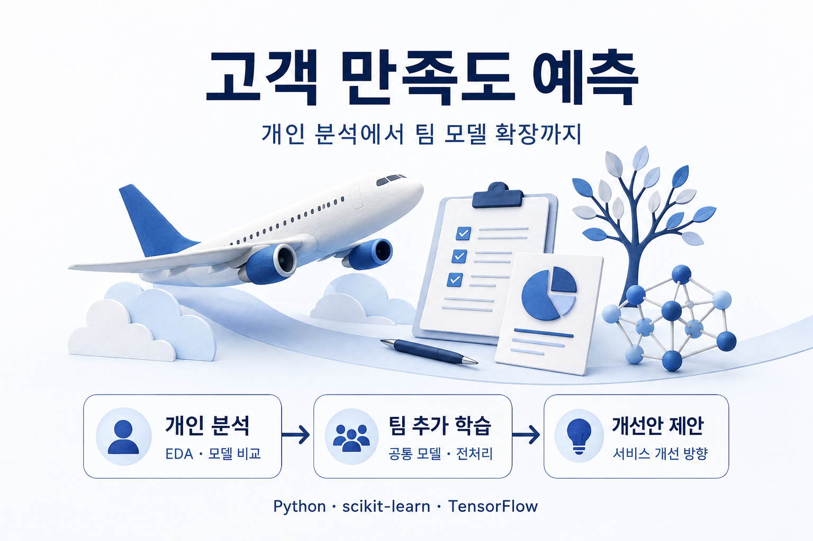
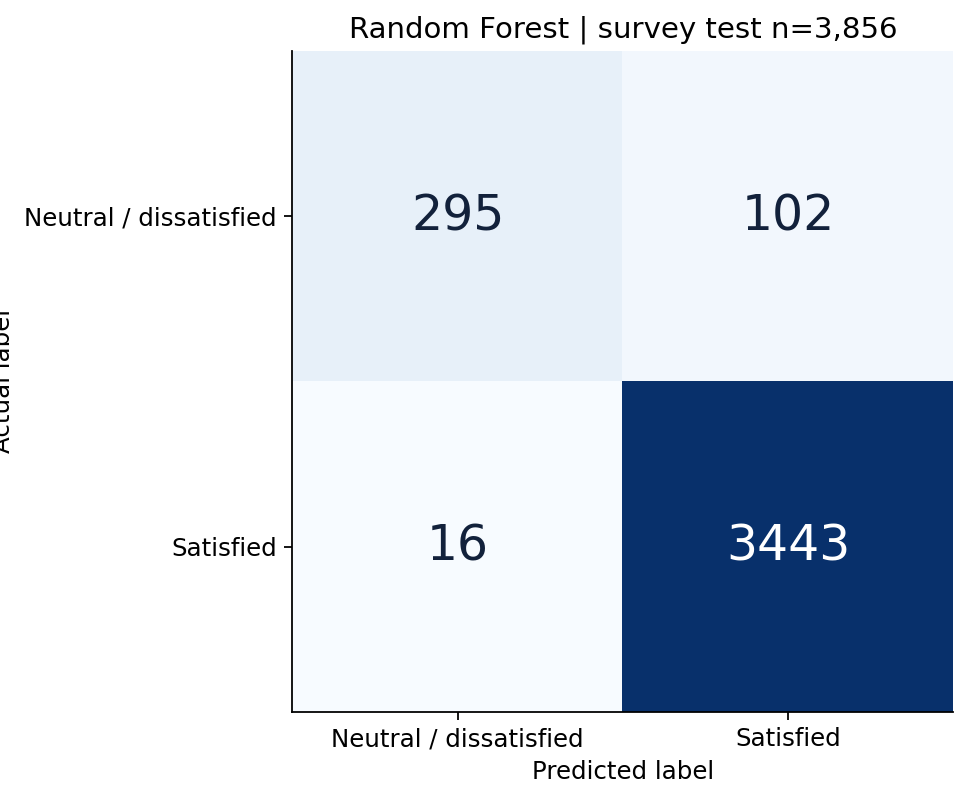
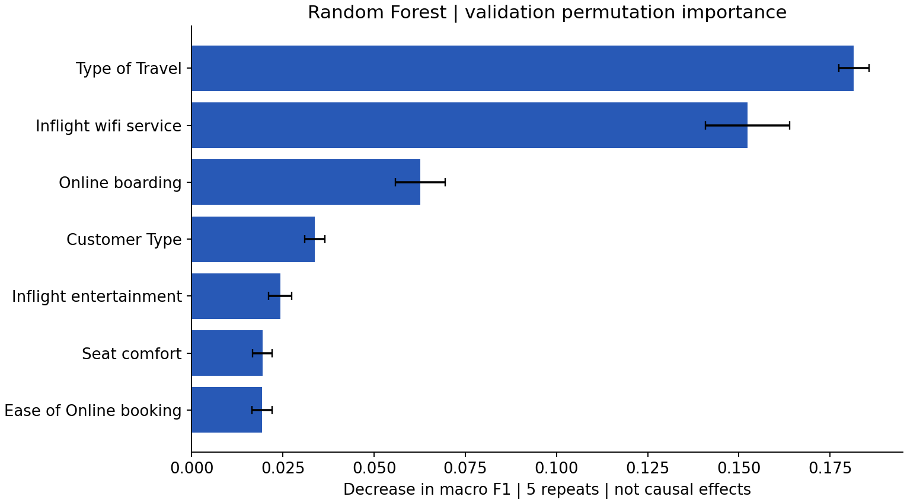

# 고객 만족도 예측 | 머신러닝·딥러닝 비교분석



항공 고객 설문에서 만족 여부를 예측하고, 서비스 개선안을 제안한 프로젝트입니다.
**개인 EDA·기본 모델링 → 팀 공통 모델 선정·추가 학습 → 서비스 개선안 논의**로 진행했습니다.

- 프로젝트 기간: 2026.04.14–2026.04.15
- 수행 형태: 개인 분석 후 8인 팀 추가 분석
- 내 역할: 개인 EDA·기본 모델링 수행, 팀 공통 모델의 추가 분석과 서비스 개선안 논의 참여
- 성과 범위: 예측 모델과 분석 결과, 개선안 제안. 실제 서비스 개선 효과는 측정하지 않았습니다.
- **2026.09.07 코드 정비·재검증:** 아래 성능은 새로 측정한 결과이며 4월 당시 성과와 구분합니다. 코드 보완과 실행 점검에는 AI 코딩 도구를 활용했습니다.

[재검증 상세 기록](reanalysis/REVALIDATION.md) · [결과보고서·코드 대조](reanalysis/SOURCE_COMPARISON.md) · [측정 결과](reanalysis/results/) · [원본 보존 자료](archive/)

## 1. 프로젝트 개요

**문제:** 전체 만족 비율이 높은 데이터에서 정확도만 보면 중립 또는 불만족 고객에 대한 예측 한계를 놓칠 수 있습니다. 어떤 서비스 항목을 추가 조사할지 판단할 분석 근거도 필요했습니다.

**데이터:** survey.csv 19,278건. 만족 17,293건, 중립 또는 불만족 1,985건(약 10.3%). 타깃 0은 단순 불만족이 아니라 **Neutral or Dissatisfied**, 1은 Satisfied입니다.

**팀과 개인의 연결:** 개인별 EDA와 기본 모델 학습 결과를 비교한 뒤, 팀이 선정한 한 구성원의 모델을 공통 파일로 사용해 추가 학습·전처리 분석을 진행했습니다. 공통 모델을 제가 단독 제작했다고 주장하지 않습니다.

**당시 팀 보고서의 선택:** 여러 구조의 학습 곡선을 비교하고 Dropout(0.3)+EarlyStopping, 학습률0.001 모델을 팀 최적 모델로 소개했습니다. 7번 슬라이드 Accuracy0.97, 9~10번 슬라이드 추가 학습·미세 조정 결과는 당시 보고서의 반올림 수치입니다. 현재 저장 모델의 전체 실행 이력과 일치하는지 확인되지 않아 아래 새 실험 수치와 구분합니다.

## 2. 문제 해결 과정

| 단계 | 당시 수행 내용 | 정비·재검증에서 보완한 점 |
|---|---|---|
| 개인 EDA | 분포·결측치·서비스 항목 분석, RF 중요도와 연령대별 분석 | 실제 변수명과 타깃 의미 확인, 중요도를 인과효과와 구분 |
| 개인 기본 모델링 | Dense 기반 모델 구조·Dropout·EarlyStopping 비교 | 모델별 예측 재계산, 학습 데이터 기준 전처리, validation/test 구분 |
| 팀 추가 분석 | 팀 공통 모델을 활용한 추가 학습·미세 조정 | 고정 입력 스키마, 독립 checkpoint 로딩, 동일 평가 절차 |
| 개선안 도출 | 변수 중요도를 서비스 개선 방향으로 연결 | 실제 도입 효과와 개선 제안을 명확히 구분 |

재검증에서는 **validation macro F1**을 모델 선택 기준으로 사용하고, 정확도와 0 클래스 recall을 함께 확인했습니다. 이 기준을 4월 당시 적용했다고 소급해 쓰지 않습니다.

### 확인 가능한 구현

- [학습·평가 파이프라인](reanalysis/pipeline.py): 계층 분할 후 train-only 전처리, 모델마다 새 예측, 검증 기준으로 선택 후 test 평가
- [실제 팀 저장 모델 검증](reanalysis/legacy_shared.py): 원본 78개 입력 복원, 저장 scaler와 수치 일치 검증, 독립 추가 학습
- [회귀 테스트](tests/test_pipeline.py): 배치별 변환 일관성, ID 중복 차단, 예측값 재사용 방지 등
- 루트 노트북 3개: 재검증 결과와 실행 함수의 연결을 확인하는 실행 완료 노트북
- 원본 노트북의 코드와 출력은 archive/notebooks/에 그대로 보존

## 3. 핵심 기여와 결과

### 개인 분석과 모델 비교 — 9월 재검증

19,278건을 train 11,566 / validation 3,856 / test 3,856건으로 계층 분할했습니다(seed 42).
validation으로 선택한 Random Forest의 test 결과입니다.

| Accuracy | Macro F1 | 중립 또는 불만족 Recall | Test 표본 |
|---:|---:|---:|---:|
| 96.94% | 0.908 | 74.31% | 3,856 |

정확도는 높지만 0 클래스 397건 중 102건을 놓쳤습니다. 이 한계 때문에 정확도 하나만 대표 성과로 내세우지 않습니다.



### 팀 공통 모델 추가 학습 — 별도 재검증

실제 제공된 원본 저장 모델을 사용했습니다. 추가 학습 850건은 train 680 / validation 170건으로 분할하고, 350건으로 평가했습니다.

| 실험 | Validation Macro F1 | Test Accuracy | Test Macro F1 | Test Recall 0 |
|---|---:|---:|---:|---:|
| 원본 공통 모델, 추가 학습 전 | 0.923 | 90.57% | 0.906 | 83.25% |
| 전체 층 추가 학습 — 검증 기준 선택 | 0.953 | 91.71% | 0.917 | 91.10% |

신규 학습·일부 층 미세 조정까지 포함한 전체 결과는 [상세 기록](reanalysis/REVALIDATION.md)에 있습니다.
이 표본의 변화는 서비스 도입 효과나 통계적으로 입증된 개선을 뜻하지 않습니다.
원본 전처리 일부를 복원했고 모델의 전체 학습 이력이 확인되지 않아 해석에 제약이 있습니다.

### 분석을 서비스 제안으로 연결



새 RF 분석에서 여행 목적, 기내 Wi-Fi, 온라인 탑승이 상위 변수로 나타났습니다.

- 여행 목적은 개선 대상이 아니라 고객 세분화 기준으로 활용합니다.
- Wi-Fi와 온라인 탑승 절차는 불편 지점을 추가 조사할 서비스 후보로 제안합니다.
- 변수 중요도는 인과효과가 아닙니다. 불만 감소율·매출 증가·운영 절감 효과는 측정하지 않았습니다.

### 한계와 회고

개인 분석 결과를 팀의 공통 모델 분석으로 연결하며, 모델 성능과 서비스 관점의 해석을 함께 논의했습니다.
포트폴리오 정비에서는 성능 숫자뿐 아니라 예측값 갱신, 전처리 일관성, 평가 데이터 경계를 확인하는 과정이 필요했습니다.

현재 결과는 단일 seed·단일 분할의 재검증입니다. 기존 test는 이미 살펴본 자료여서 새 블라인드 평가가 아닙니다.
후속 과제로 여러 seed·교차검증, 오류 사례 분석, 독립 신규 데이터 평가, 서비스 개선안의 별도 검증을 남겼습니다.

## 실행 방법

Python 3.12 CPU 환경에서 실행했습니다. 원본 CSV와 저장 모델은 덮어쓰지 않습니다.

```bash
python -m pip install -r requirements-lock.txt
python -m pytest -q
python -m reanalysis.pipeline
python -m reanalysis.legacy_shared
python -m reanalysis.publish_results
```

첫 명령은 검증 환경의 고정 버전을 설치합니다. 직접 지정한 주요 패키지는 requirements.txt에 있습니다.
새 학습 파일은 reanalysis/artifacts/에 저장되며 Git 추적에서 제외됩니다.

### 기술

Python · pandas · NumPy · scikit-learn · TensorFlow/Keras · Matplotlib

원본 EDA: Seaborn, RandomForest / 재검증 전처리: SimpleImputer, OneHotEncoder, MinMaxScaler

원본 코드에서 확인하지 못한 BatchNormalization 적용이나 실시간 대시보드 운영은 주장하지 않습니다.

### 증빙자료

- [프로젝트 Notion](https://app.notion.com/p/AI-3617a7a87a178090877eeff34855c330)
- [당시 팀 발표자료 — 원본](https://docs.google.com/presentation/d/1lkCz70NTFm90aFLEqleQ-xGWK0fwbQWL/edit?usp=sharing)
- [데이터 정의/ERD — 원본](https://drive.google.com/file/d/135vLMiKtakCtvDIqWdS1fT4qJPrAeeiU/view?usp=sharing)
- [구현 과정 보고서 — 원본](https://drive.google.com/file/d/1kfQnIY8Z-844BtsVInE6CJov19utgAYv/view?usp=sharing)
- 원본 보고서·발표자료의 수치를 인용할 때는 재검증 기록의 정정 사항을 함께 확인해야 합니다.
