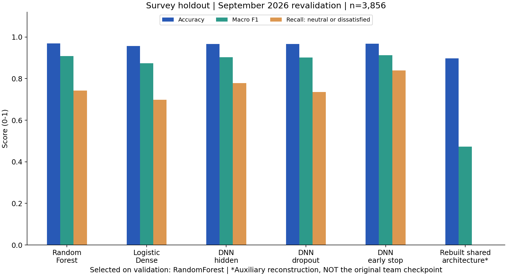

# 2026-09-07 재검증 기록

이 문서는 2026.04.14–15 당시 성과를 재현했다고 주장하지 않습니다. 코드 오류를 보완하고 현재 환경에서 다시 측정한 기록입니다. 코드 정비와 실행 점검에 AI 코딩 도구를 활용했습니다.

## 무엇을 고쳤는가

| 문제 | 적용한 수정 | 확인 방법 |
|---|---|---|
| 02/03 후속 모델이 예전 y_pred를 재사용 | 모델마다 predict를 호출하는 공통 평가 함수 | 서로 반대 예측을 내는 두 모델 테스트 |
| 변환 배치마다 결측치/범주 매핑을 다시 계산 | 학습 시 결정한 전처리 객체 재사용 | 단일 행/배치 변환 일치 테스트 |
| 학습 전에 전체 데이터로 결측치 처리 | 새 survey 실험은 분할 후 학습 데이터로만 fit | 공통 pipeline 코드와 split_ids.csv |
| 추가 학습 중 원본 모델 참조 재사용 | 실험마다 checkpoint를 새로 load | 독립 모델 객체로 학습 |
| 성능 기준/데이터 경계 불명확 | validation 선택, test 평가, threshold 0.5 고정 | results.json에 선택 기준과 표본 수 기록 |
| README 기술/성과 주장 불일치 | MinMaxScaler·Dense·Dropout 중심으로 수정, 미측정 운영 효과 삭제 | 원본 노트북/저장 모델과 대조 |

정정: 원본 EDA에도 RandomForest와 stratify 분할은 이미 있었습니다. 0 클래스는 **중립 또는 불만족**입니다.

## A. 개인 모델링 흐름의 새 평가

- 원본 survey 19,278건: 만족 17,293건 / 중립 또는 불만족 1,985건.
- 계층 분할: train 11,566 / validation 3,856 / test 3,856. seed 42.
- 학습 데이터만으로 결측치·범주 인코딩·MinMaxScaler 학습. 새 입력은 83개이며 원본 78개와 다릅니다.
- 후보: RF, 단층 sigmoid, hidden DNN, dropout DNN, early stopping DNN, 공유 모델 구조 재구성 보조 실험.
- 선택 기준: validation macro F1, 동률이면 0 클래스 recall. test를 보고 선택을 바꾸지 않았습니다.
- 선택 RF의 test: Accuracy **96.94%**, macro F1 **0.908**, 0 클래스 recall **74.31%**.
- 혼동행렬은 실제 0/1 행, 예측 0/1 열: `[[295,102],[16,3443]]`.
- test macro F1은 DNN earlystop이 0.913으로 더 높지만, 이를 근거로 모델을 사후 교체하지 않았습니다.
- 공유 구조를 83개 입력으로 새로 학습한 보조 실험은 0 클래스 recall 0으로 붕괴했습니다. **원본 팀 모델의 성능이 아닙니다.** 이 실패 결과도 전체 표에 보존했습니다.




## B. 실제 원본 팀 저장 모델의 추가 학습

여기서 원본은 저장소에 제공된 파일을 뜻합니다. 팀 발표에 쓰인 checkpoint와 완전히 같은 버전인지는 확인되지 않았습니다. 보고서9번의 기본 모델 Accuracy0.88과 현재 파일90.57%는 다릅니다. [슬라이드별 대조](SOURCE_COMPARISON.md)를 함께 확인하세요.

- 두 .keras 파일은 SHA256이 동일하며, 78입력·64/32/16/8/4 hidden·Dropout 0.3 구조입니다.
- 원본 개인 노트북 마지막 모델과 구조가 다르므로 같은 모델이라고 단정하지 않습니다.
- 원본 결측치/인코더 객체가 없어 survey와 원본 규칙으로 복원했습니다. saved scaler의 scale/min/data_min/data_max는 원본 80/20 split 재구성 값과 일치했습니다.
- 저장 scaler는 sklearn 1.6.1, 실행 환경은 1.7.2입니다. 로드 경고를 결과에 보존했고 수치 일치 확인 후 현 버전 재구성 scaler를 사용했습니다.
- 추가 train 850건을 train 680 / validation 170건으로 계층 분할. 별도 test 350건. 세 CSV 사이 ID 중복은 0건입니다.

| 원본 모델 기반 실험 | validation macro F1 | test Accuracy | test macro F1 | test recall 0 |
|---|---:|---:|---:|---:|
| 추가 학습 전 | 0.923 | 90.57% | 0.906 | 83.25% |
| 같은 구조 신규 학습 | 0.928 | 88.29% | 0.882 | 90.58% |
| 전체 층 추가 학습 — validation 선택 | 0.953 | 91.71% | 0.917 | 91.10% |
| 일부 층 미세 조정 | 0.935 | 92.29% | 0.923 | 88.48% |

추가 학습 전 혼동행렬 `[[159,32],[1,158]]`는 원본 출력과 일치했습니다. 선택된 전체 층 추가 학습의 Accuracy 변화는 이 표본에서 **+1.14%p**입니다. 통계적으로 유의한 개선이나 서비스 효과로 해석하지 않습니다. test가 가장 높다는 이유로 미세 조정을 사후 선택하지 않았습니다.

중요 제약: 전처리 복원 가정과 모델의 전체 학습 이력 불확실성이 남아 있습니다. 과거에 이미 살펴본 test를 사용했으므로 새 블라인드 벤치마크가 아닙니다. A와 B는 데이터·입력·학습 이력이 달라 같은 순위표에 섞지 않습니다.

## C. 해석과 서비스 제안

RF validation permutation importance(5회 반복, macro F1 감소): 여행 목적 0.182, 기내 Wi-Fi 0.152, 온라인 탑승 0.063 순입니다. 원본 EDA의 impurity importance와는 다른 지표입니다.


- 여행 목적: 직접 바꿀 서비스 항목이 아니라 고객 세분화 기준으로 활용합니다.
- Wi-Fi·온라인 탑승: 저평가 고객의 불편 지점을 추가 조사할 후보입니다.
- 중요도는 인과효과가 아니며, 설문 점수 조작으로 만족도를 올릴 수 있다는 뜻이 아닙니다.
- 결과를 토대로 개선안을 제안했을 뿐 실제 서비스 도입·불만 감소·매출 효과는 측정하지 않았습니다.

## 재실행

Python 3.12, CPU 환경에서 실행했습니다. 세부 버전과 데이터 해시/모델 설정은 results.json과 requirements-lock.txt에 있습니다.

고객 ID가 포함된 split_ids.csv는 로컬 재현 점검용이며 공개 저장소에서 제외합니다. 실행하면 동일 seed와 분할 규칙으로 다시 생성됩니다.

```bash
python -m pip install -r requirements-lock.txt
python -m pytest -q
python -m reanalysis.pipeline
python -m reanalysis.legacy_shared
python -m reanalysis.publish_results
```

`pipeline --smoke --output reanalysis/smoke-results`는 2epoch 실행 점검용이며 포트폴리오 성능으로 인용하지 않습니다. 학습 산출물은 reanalysis/artifacts/에 저장되며 원본 모델을 덮어쓰지 않습니다.

단일 seed, 단일 분할, 단일 로컬 실행입니다. 교차검증/여러 seed/외부 신규 표본 평가는 향후 과제입니다. TensorFlow 실행 시 호환성·retracing 경고가 있었으나 실행은 종료 코드 0으로 완료됐습니다.
